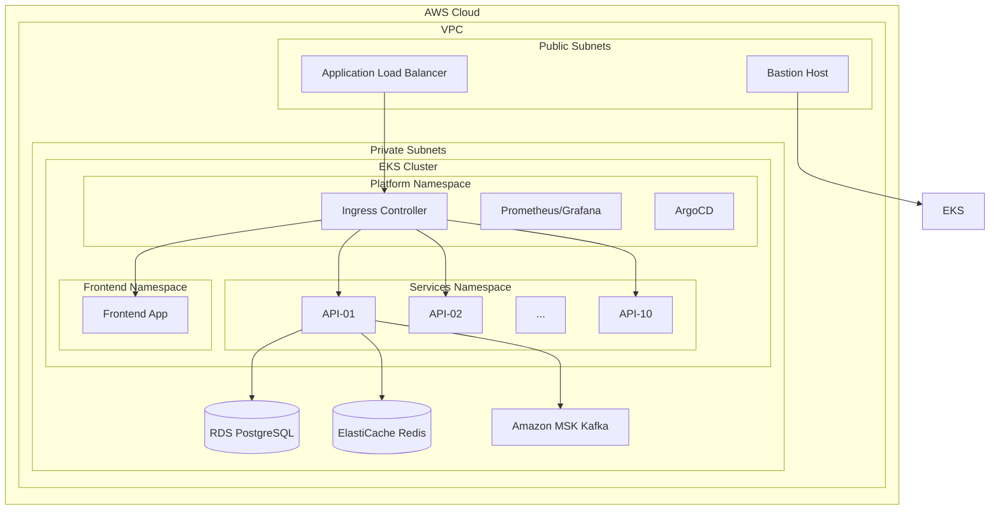

# Atlas Micro IaC - Enterprise Microservices Platform

A comprehensive Infrastructure as Code solution for deploying and managing enterprise-grade microservices architecture on AWS using Terraform and Ansible.

## Architecture Overview

This project implements a production-ready microservices platform on AWS, featuring modern cloud-native technologies and best practices. The platform includes the following components:

- **Kubernetes**: Amazon EKS cluster with managed node groups and auto-scaling
- **Load Balancing**: AWS Application Load Balancer with advanced routing
- **Databases**: Amazon RDS PostgreSQL with Multi-AZ deployment
- **Caching**: Amazon ElastiCache Redis cluster for high-performance caching
- **Messaging**: Amazon MSK (Managed Streaming for Apache Kafka) for event-driven architecture
- **Observability**: Comprehensive monitoring with Prometheus, Grafana, and CloudWatch
- **GitOps**: ArgoCD for continuous deployment and configuration management
- **Security**: IAM roles, security groups, encryption at rest and in transit

### System Architecture



## Key Features

### Modular Infrastructure Components
- **Configurable Data Layer**: Toggle RDS PostgreSQL, ElastiCache Redis, and Amazon MSK independently
- **Scalable Compute**: EKS cluster with managed node groups and horizontal pod autoscaling
- **High Availability**: Multi-AZ deployments across availability zones
- **Security First**: IRSA, encryption, network policies, and least-privilege access

### Microservices Architecture
- **10 Independent API Services**: Each with dedicated namespaces and configurations
- **Modern Frontend**: React-based web application with NGINX reverse proxy
- **Platform Services**: Comprehensive monitoring, logging, and GitOps capabilities
- **Event-Driven Communication**: Kafka-based messaging for loose coupling

## Getting Started

### Prerequisites
- **Terraform** >= 1.6
- **Ansible** >= 2.12  
- **AWS CLI** with configured credentials
- **kubectl** for Kubernetes management
- **Helm** >= 3.8 for package management

### Quick Start

1. **Infrastructure Deployment**
```bash
# Initialize Terraform
make tf-init

# Validate configuration
make tf-validate

# Plan infrastructure changes
make tf-plan ENV=dev

# Deploy infrastructure
terraform apply -var-file=envs/dev.tfvars
```

2. **Bastion Host Configuration**
```bash
# Run Ansible linting
make ansible-lint

# Configure bastion host
ansible-playbook -i inventory/hosts.yml playbooks/bastion.yml

# Bootstrap cluster components
ansible-playbook -i inventory/hosts.yml playbooks/cluster-bootstrap.yml
```

3. **Application Deployment**
```bash
# Create namespaces
kubectl apply -f k8s/namespaces/

# Deploy API services using Helm
for i in {01..10}; do
  helm install api-$i helm/api-generic-chart/ \
    -f helm/api-generic-chart/values-api-$i.yaml \
    -n services
done

# Deploy frontend application
kubectl apply -f k8s/frontend/ -n frontend
```

### Environment Configuration

The platform supports multiple environments with customizable configurations in the `envs/` directory:

- **`envs/dev.tfvars`**: Development environment with minimal resources
- **`envs/stage.tfvars`**: Staging environment for pre-production testing  
- **`envs/prod.tfvars`**: Production environment with high availability and full feature set

### Infrastructure Toggles

```hcl
# Development - Cost-optimized
enable_rds   = true
enable_redis = false
enable_msk   = false

# Production - Full stack
enable_rds   = true
enable_redis = true
enable_msk   = true
multi_az     = true
```

## Project Structure

```
atlas-micro-iac/
├── terraform/          # Infrastructure as Code modules and configurations
├── ansible/            # Configuration management and automation
├── k8s/               # Kubernetes manifests and deployments
├── helm/              # Helm charts for application packaging
├── envs/              # Environment-specific variable files
├── docs/              # Project documentation and guides
└── .github/workflows/ # CI/CD automation pipelines
```

### Module Organization

- **`terraform/modules/`**: Reusable infrastructure modules (VPC, EKS, RDS, Redis, MSK)
- **`ansible/roles/`**: Automation roles for bastion and common configurations
- **`k8s/namespaces/`**: Kubernetes namespace definitions for logical separation
- **`helm/api-generic-chart/`**: Template-based deployment for microservices

## Production Considerations

This platform has been designed with production-grade requirements in mind. Key operational aspects implemented:

### Security & Compliance
- ✅ **Encryption**: All data encrypted at rest and in transit using AWS KMS
- ✅ **Identity Management**: IRSA (IAM Roles for Service Accounts) for fine-grained permissions
- ✅ **Network Security**: VPC isolation, security groups, and network policies
- ✅ **Secrets Management**: Integration with AWS Secrets Manager for credential storage
- ✅ **Access Control**: Least-privilege IAM policies and RBAC implementation

### High Availability & Reliability
- ✅ **Multi-AZ Deployment**: Database and cache clusters across availability zones
- ✅ **Auto-scaling**: Horizontal pod autoscaling and cluster autoscaling configured
- ✅ **Load Balancing**: Application Load Balancer with health checks and failover
- ✅ **Backup Strategy**: Automated RDS backups and disaster recovery procedures
- ✅ **Monitoring**: Comprehensive observability with Prometheus, Grafana, and CloudWatch

### DevOps & Automation
- ✅ **Infrastructure as Code**: Complete Terraform automation with state management
- ✅ **GitOps Workflow**: ArgoCD for continuous deployment and configuration drift detection
- ✅ **CI/CD Pipeline**: GitHub Actions for testing, security scanning, and deployment
- ✅ **Configuration Management**: Ansible for automated provisioning and updates

## Monitoring & Observability

The platform includes comprehensive monitoring and logging capabilities:

### Metrics & Monitoring
- **Prometheus**: Collects metrics from all application and infrastructure components
- **Grafana**: Provides rich dashboards for visualization and alerting
- **CloudWatch**: AWS-native monitoring for infrastructure metrics and logs
- **Custom Metrics**: Application-specific business metrics and SLIs

### Logging & Tracing
- **Centralized Logging**: ELK stack for log aggregation and analysis
- **Distributed Tracing**: Jaeger integration for microservices tracing
- **Audit Logs**: Complete audit trail for security and compliance

## Cost Optimization

The infrastructure is designed with cost efficiency in mind:

- **Spot Instances**: Optional spot instance support for non-critical workloads
- **Auto-scaling**: Dynamic scaling based on demand to minimize waste
- **Resource Tagging**: Comprehensive tagging for cost allocation and optimization
- **Environment Toggles**: Disable expensive components in development environments

## Contributing

We welcome contributions to improve the platform. Before submitting a pull request:

1. Run `make tf-fmt` to format Terraform code
2. Validate with `make tf-validate` 
3. Lint Ansible playbooks with `make ansible-lint`
4. Ensure all tests pass in CI/CD pipeline

## License

Licensed under the MIT License - see the [LICENSE](LICENSE) file for details.

---

**Atlas Micro Platform** - Enterprise-grade microservices infrastructure for modern cloud applications.
